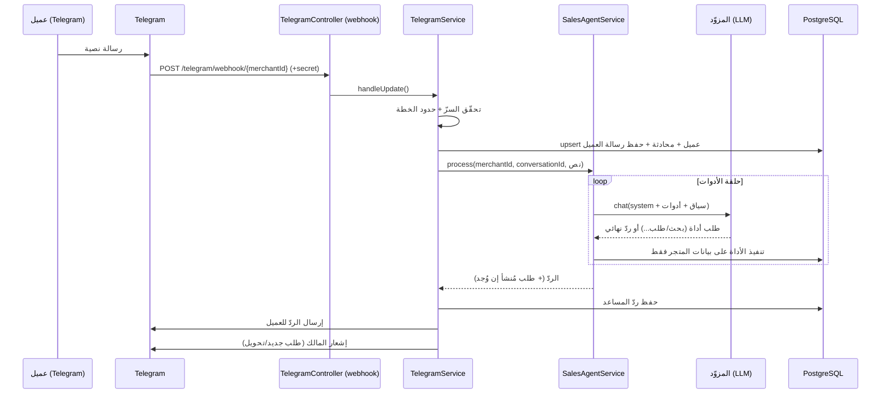

<div dir="rtl">

# البنية المعمارية — SellMate AI

## نظرة عامة

النظام مبني على مبادئ **Clean Architecture** و**Modular Design**: كل مجال (domain) وحدة NestJS مستقلة لها خدمتها ومتحكمها وDTOs، مع طبقة مشتركة (common) للحُرّاس والفلاتر والاعتراضات، وطبقة وصول بيانات موحّدة عبر Prisma.

```
┌─────────────────────────────┐        ┌──────────────────────────────┐
│   لوحة التحكم (Next.js)      │        │      عميل عبر Telegram        │
│   عربي RTL — App Router      │        │                              │
└──────────────┬──────────────┘        └───────────────┬──────────────┘
               │ REST (JWT)                              │ Webhook (secret)
               ▼                                         ▼
        ┌────────────────────────────────────────────────────────┐
        │                    NestJS API (apps/api)                │
        │  Guards · Filters · Interceptors · Validation           │
        │ ┌─────────┬──────────┬─────────┬───────────┬──────────┐ │
        │ │  auth   │ products │ orders  │ customers │  faqs …  │ │
        │ ├─────────┴──────────┴─────────┴───────────┴──────────┤ │
        │ │       AI Engine (مؤصَّل)      │   Telegram (Telegraf) │ │
        │ └──────────────┬───────────────┴──────────┬───────────┘ │
        └────────────────┼──────────────────────────┼─────────────┘
                         ▼                           ▼
                 ┌──────────────┐           ┌─────────────────┐
                 │  PostgreSQL  │           │  مزوّد الـ LLM    │
                 │  (Prisma)    │           │ OpenAI/Anthropic │
                 └──────────────┘           └─────────────────┘
```

---

## طبقات الـ Backend

| الطبقة | المسؤولية | الموقع |
|---|---|---|
| **Config** | تحميل + تحقّق من البيئة (zod) | `src/config` |
| **Common** | الحُرّاس، الفلاتر، الاعتراضات، الديكوريتورات، الأدوات | `src/common` |
| **Prisma** | خدمة قاعدة البيانات (global) | `src/prisma` |
| **Modules** | وحدات المجال | `src/modules/*` |

**الحُرّاس العامّة** (بترتيب التنفيذ): `JwtAuthGuard` (مصادقة، يتخطّى `@Public()`) → `RolesGuard` (RBAC) → `ThrottlerGuard` (حدود المعدل).

**معالجة الأخطاء**: `AllExceptionsFilter` يوحّد أخطاء HTTP وPrisma في استجابة JSON ثابتة دون تسريب تفاصيل داخلية.

---

## خريطة الوحدات

| الوحدة | المسؤولية |
|---|---|
| `auth` | التسجيل، الدخول، تدوير الرموز، RBAC |
| `merchants` | ملف المتجر + إعدادات الذكاء الاصطناعي |
| `products` | المنتجات (CRUD + بحث) — مصدر معرفة المساعد |
| `inventory` | حركات المخزون (تعديل ذرّي) |
| `orders` | دورة حياة الطلب (حساب السعر من الخادم + خصم المخزون) |
| `customers` | عملاء Telegram (إنشاء تلقائي) |
| `conversations` | سجلّ المحادثات والرسائل + سياق الـ AI |
| `faqs` | الأسئلة الشائعة — مصدر معرفة إضافي |
| `ai` | محرّك المبيعات: طبقة المزوّد + الأدوات + الوكيل |
| `telegram` | ربط البوتات ومعالجة الـ webhook |
| `subscriptions` | الخطط، الاشتراك، قياس الاستخدام وحدوده |
| `payments` | طبقة دفع قابلة للتبديل (Stripe/none): checkout + webhook |
| `analytics` | الإحصائيات والملخّصات |

**لا دورات (cycles)** بين الوحدات: التبعيات أحادية الاتجاه (مثال: `telegram → ai → orders → subscriptions`).

---

## نموذج البيانات (Prisma)

الكيانات الرئيسية (كلّها مرتبطة بـ `Merchant`):

- **Merchant** (المستأجر) — 1:1 مع `AiSettings`, `TelegramBot`, `Subscription`.
- **User** (طاقم المتجر) + **RefreshToken** (جلسات).
- **Product** (بحقل `category` نصّي، `oldPrice`, `currency`, `imageUrl`, وحالة `OUT_OF_STOCK`)، **StockMovement**.
- **Customer**, **Conversation**, **Message**.
- **Faq**، **KnowledgeEntry** (قاعدة المعرفة — مصدر الاسترجاع RAG، معزولة بـ `merchantId`).
- **Order** (حالات PENDING→CONFIRMED→PROCESSING→SHIPPED→COMPLETED/CANCELLED، مع `discount` و`notes`)، **OrderItem** (لقطة سعر/اسم المنتج وقت الطلب).
- **Plan**, **Subscription**, **UsageRecord** (عدّاد شهري لكل مقياس).

الفهارس مضبوطة على `merchantId` والحقول الأكثر استعلامًا. الحذف متتالٍ (`onDelete: Cascade`) من المتجر لضمان النظافة.

---

## عزل المستأجرين (Multi-tenancy)

- الـ JWT يحمل `merchantId`؛ يُستخرَج عبر `@CurrentMerchantId()`.
- كل استعلام يُقيَّد بـ `merchantId` (لا استعلام عام).
- الأدوات التي يستخدمها الـ AI تمرّر `merchantId` من سياق المحادثة فقط.
- الأدوار (RBAC): **OWNER** (كل شيء)، **ADMIN** (كل شيء عدا الفوترة وحذف المتجر)، **STAFF** (المنتجات/الطلبات/العملاء/المحادثات) — عبر `RolesGuard` وديكوريتور `@Roles()`. إدارة الفريق في وحدة `users` (لـ OWNER/ADMIN).

النتيجة: عزل صارم — لا يرى متجر بيانات متجر آخر إطلاقًا.

---

## تدفّق رسالة Telegram



---

## تصميم التأصيل ومنع الهلوسة

يقوم على أربع دعائم:

1. **رسالة نظام = سياسة بيع استشاري** (`ai/prompt.ts`): تُوجّه المساعد عبر خطوات بيع محترفة (فهم الحاجة ← الترشيح ← أفضل ٢–٣ خيارات ← شرح السعر ← معالجة الاعتراضات ← الطلب)، مع إلزامه بالاعتماد على الأدوات فقط، ومنع اختراع أي منتج/سعر/خصم/معلومة، وفرض التحويل عند غياب المعلومة.
2. **أدوات مقيّدة القراءة** (`ai/tools/sales-tools.service.ts`): `search_products` (مع فلترة بالسعر `minPrice/maxPrice` والتصنيف والترتيب لاقتراح أفضل الخيارات ضمن الميزانية)، `get_product`, `list_products`, `search_knowledge` (استرجاع RAG من قاعدة معرفة المتجر)، `get_store_info`, `get_order_status` (تتبّع طلب العميل)، `create_order` — كلّها تُنفَّذ ضمن سياق المتجر الحالي حصريًا (مقيّدة بـ `merchantId`، وطلبات العميل مقيّدة بـ `customerId`).
3. **حلقة الوكيل** (`ai/sales-agent.service.ts`): تدير استدعاء الأدوات حتى الردّ النهائي، مع سقف تكرارات، ومقياس استخدام، والتقاط أي طلب مُنشأ.
4. **خطوة التحقّق من الردّ** (`ai/ai-response.validator.ts`): تفحص كل مبلغ مقترن بعملة في الردّ وتتأكد أنه مؤصَّل في بيانات المتجر (أسعار المنتجات، أرقام الأسئلة الشائعة، إجمالي طلب أُنشئ)؛ وإلا تستبدل الردّ برسالة آمنة — دفاع في العمق ضد اختراع الأسعار.

خط معالجة البوت في `telegram/telegram.dispatcher.ts` يفصل الأوامر والأزرار الضمنية عن النصوص الحرّة، ويمرّر الأخيرة عبر هذا الخط المؤصَّل.

**طبقة المزوّد** (`ai/providers/`) محايدة: `OpenAiProvider`, `AnthropicProvider`, `GeminiProvider`, `NullProvider` تتحدث جميعها أنواعًا موحّدة (`AiChatRequest/Result`)، ويُختار المزوّد عبر متغيّر بيئة واحد (`AI_PROVIDER`) مع مفتاح عام (`AI_API_KEY`). التبديل بلا لمس بقية الكود. المبدأ نفسه ينطبق على `payments/` عبر `PAYMENT_PROVIDER`.

الأسعار والمخزون تُحسب من قاعدة البيانات وقت إنشاء الطلب (`orders.service.ts`) داخل معاملة ذرّية — لا يُوثق بأي رقم من المحادثة.

---

## لوحة التحكم (Next.js)

- **App Router** + مكوّنات client، مصادقة عبر سياق `AuthProvider` (رموز في المتصفح + تدوير تلقائي عند 401).
- **RTL عربي** كامل (`dir="rtl"`, `lang="ar"`) + Tailwind.
- الشريط الجانبي والصفحات: الرئيسية (٨ مؤشرات + ٤ رسوم بيانية + أحدث الطلبات/المحادثات + أفضل المنتجات)، المنتجات، الطلبات، العملاء، المحادثات، قاعدة المعرفة، إعدادات الذكاء (مع معاينة حيّة)، التحليلات (رسوم قابلة للمدى + توزيع الحالات)، الاشتراك، الإعدادات.
- الرسوم البيانية مبنية بـ SVG بلا مكتبات خارجية (`lib/charts.tsx`) وفق مبادئ dataviz: سلسلة واحدة لكل رسم، ألوان مُتحقَّقة، خطوط شبكة خافتة، ونصوص بألوان حِبر.

</div>
